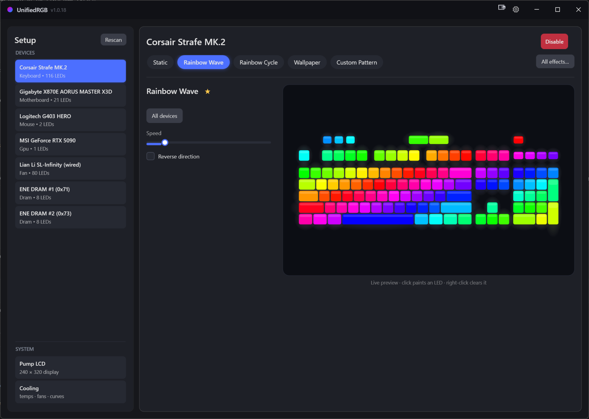
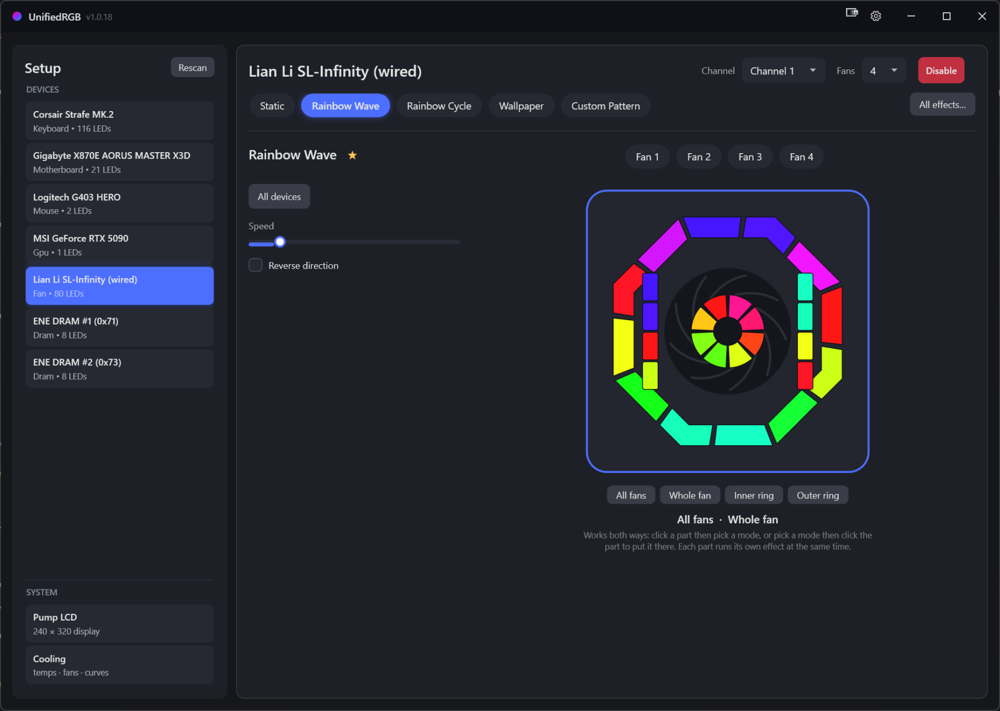
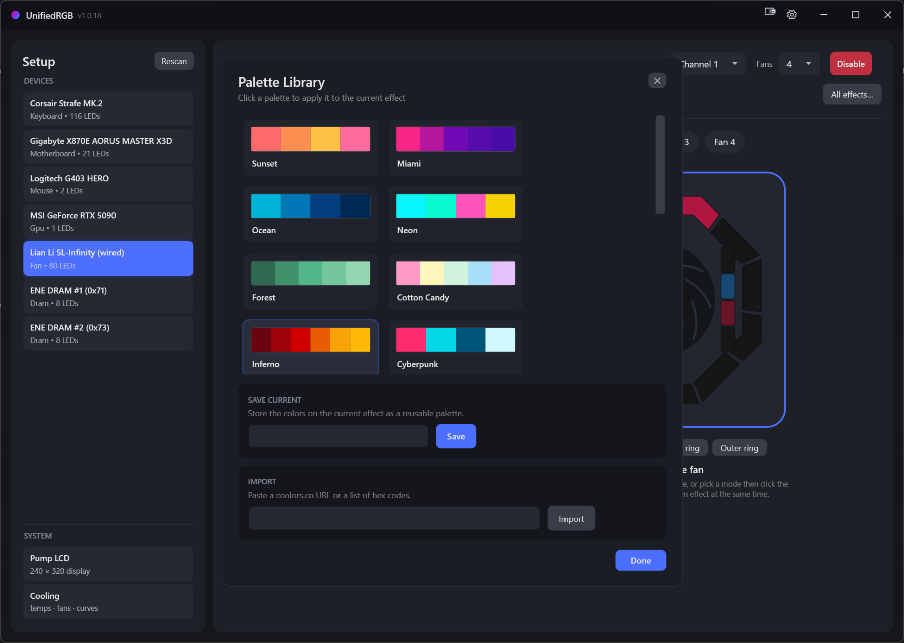
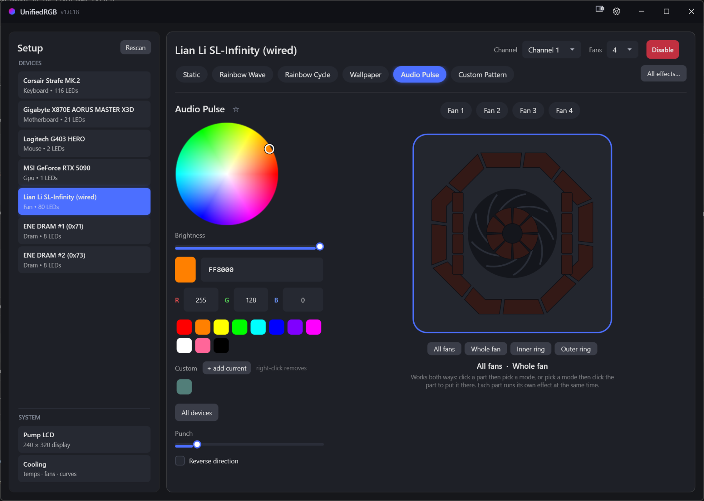
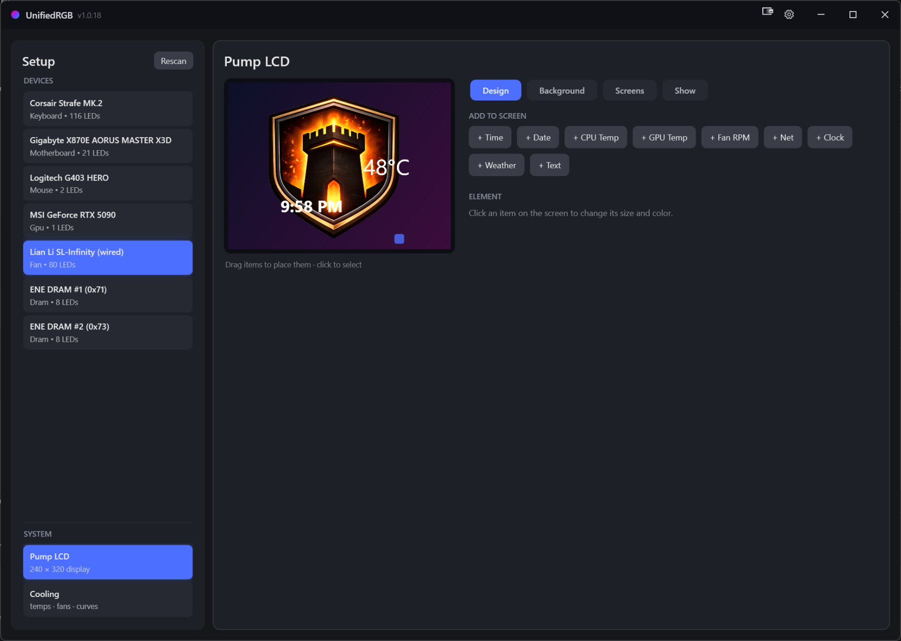
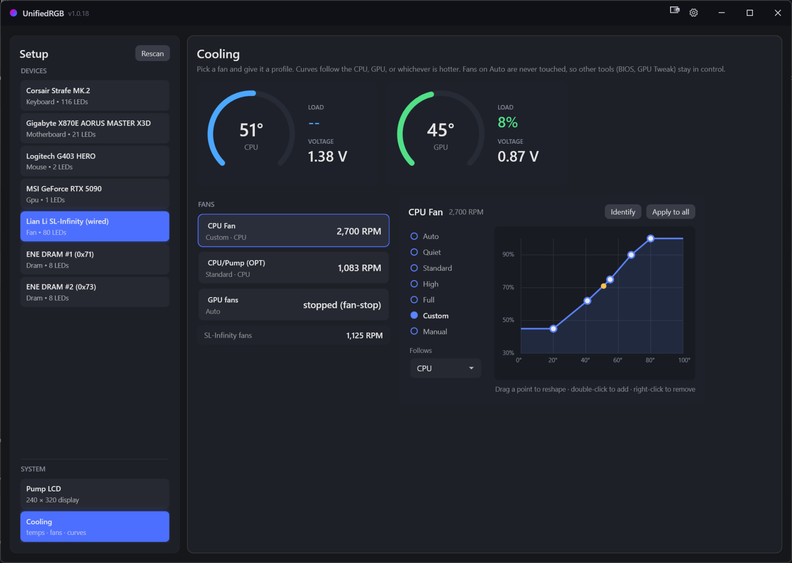

<div align="center">

# UnifiedRGB

**All your RGB. One app. Zero bloat.**

Keyboards, mice, motherboard, GPU, DRAM, fans, and the pump LCD — driven
natively from a single tray app that idles at ~0% CPU. No vendor launchers,
no accounts, no telemetry.

### [unifiedrgb.com](https://unifiedrgb.com)

[](https://github.com/fikal/UnifiedRGB/releases/latest)
[](https://github.com/fikal/UnifiedRGB/actions)
[](LICENSE)



</div>

## Download

Grab `UnifiedRGB-vX.Y.Z.exe` from the
[latest release](https://github.com/fikal/UnifiedRGB/releases/latest) — a
single self-contained exe, nothing else to install. It checks this repo for
new releases at startup and updates itself in one click (verified against
the published SHA-256; opt out in Settings).

> The binary is unsigned, so SmartScreen will warn on first run
> (**More info → Run anyway**). Verify the SHA-256 from the release notes if
> in doubt.

## The tour

### Every effect, every device, or per-zone down to the LED

~55 effects: rainbows, meteors, plasma, aurora, candle flicker, rain,
audio-reactive bars and pulses (event-driven WASAPI loopback — reacts the
instant sound does), key-reactive ripple, whole-screen ambient, Wallpaper
Engine capture, Razer Chroma game sync (no Razer software required), a
circadian Time Warmth that cools by day and warms at night, and multi-color
palette effects. Apply to one device, one fan ring, or everything at once.



Lian Li fans are zone-addressable: click a fan, a ring, or the whole array —
each part can run its own effect simultaneously.

### Pick colors like you mean it

A full wheel with brightness, hex and RGB entry, custom swatches — and a
**Palette Library** with curated presets, your own saved palettes, and
one-paste import from [coolors.co](https://coolors.co) URLs or raw hex lists.





### A real dashboard on your pump LCD

Drag-and-drop designer for Thermalright 240×320 pump displays: CPU/GPU
temps, clock faces, date, fan RPM, network throughput, weather, free text —
over image or GIF backgrounds, with multiple screens and a scene sequencer.



### Fan curves that respect your other tools

Temperature-driven curves following CPU, GPU, or whichever is hotter — with
live gauges, per-fan profiles, a drag-to-edit curve editor, and a thermal
failsafe that hands fans back to the BIOS if anything goes wrong. Fans left
on Auto are never touched, so BIOS profiles and GPU tools stay in control.



### One effect across your whole desk

Arrange your devices the way they actually sit in front of you, then run an
effect on the desk instead of on each device. A wave rolls off the keyboard,
across the mouse and up the case fans as one image, in the order they are
really in, rather than restarting on every device.

The same screen fixes the other half of that problem: telling UnifiedRGB where
a device's LEDs physically are. A strip taped along a GPU is a line, a fan is a
ring, a matrix usually snakes back on every other row. Say so once and every
effect renders correctly on it.

### Lights that react to what you are doing

Rules on temperature, load, fan speed or a wireless device's battery: cross the
number and a profile applies, drop back and your lighting returns. Schedules
for lights-off windows or a profile between two times on the days you pick.
Wireless gear shows its charge in the sidebar, amber when it is running low.

**Counter-Strike 2** drives the lights from the game's own state: health runs
green to red, molotov damage flickers amber, and a planted bomb pulses faster
as the fuse runs down. It uses Valve's Game State Integration, so nothing is
injected and nothing is read from memory.

### It plays well with what you already use

UnifiedRGB can act as an **OpenRGB SDK server**, so anything written for
OpenRGB drives your lighting unchanged: Home Assistant, game mods, phone
remotes, Stream Deck plugins. An app that takes a device over gets it, and your
lighting comes back the moment it disconnects. Loopback only unless you
explicitly allow the network, because that protocol has no password.

It also **hands your hardware back when it closes**. Instead of leaving
whatever frame happened to be last, each device can be left on a color, turned
off, or told to resume its own saved profile.

### Quality of life, everywhere

Profiles with global hotkeys (`Ctrl+Alt+1…9`, they work in games) ·
per-app auto-switching · schedules and sensor rules · master brightness ·
per-device disable · undo and redo in the LCD designer · first-run wizard ·
starts with Windows, lives in the tray.

### Fast is a feature

The whole app idles under 5% of one core with the window open, allocates
almost nothing in steady state, and drops to a whisper when minimized. Every
driver dedups frames at the write boundary so your USB bus isn't spammed
with identical packets. The optimization journey — with before/after
measurements — is documented in
[PERFORMANCE_REVIEW.md](PERFORMANCE_REVIEW.md).

## Supported hardware (native drivers)

| Device | Transport |
|---|---|
| Corsair Strafe MK.2 | HID |
| SteelSeries Apex keyboards | HID |
| Gigabyte RGB Fusion mobos (IT5711) + ARGB headers | HID |
| Logitech G403 HERO (HID++ 2.0) | HID |
| Razer Basilisk V3 Pro (lighting, DPI stages, polling rate — no Synapse; HyperFlux V2 pad probed) | HID |
| MSI GeForce GPUs | I²C via NvAPI |
| ENE DRAM (G.Skill and friends) | SMBus via PawnIO |
| Lian Li SL-INF wireless | WinUSB + RF |
| Lian Li SL-Infinity wired hub | HID |
| Sayo devices | HID |
| Thermalright pump LCD (240×320) | HID |
| Everything OpenRGB supports | opt-in bundled [OpenRGB](https://openrgb.org) over its SDK socket |

Natively-driven hardware is never handed to the OpenRGB bridge — it exists
for everything else.

## ⚠️ Read before running

- The app **requires administrator** and installs
  [PawnIO](https://pawnio.eu/) — a signed, module-constrained kernel driver —
  for CPU temperature, SMBus (DRAM RGB), and fan control. That is real kernel
  access; understand it before you run it.
- DRAM lighting talks **raw SMBus**. The implementation follows OpenRGB's
  proven ENE detection (remap-then-probe at known-safe addresses), but as
  with every tool in this category: writing to the wrong SMBus device can
  permanently damage hardware. Nothing here writes outside the detected ENE
  controllers.
- Protocols were reverse-engineered for interoperability (USB captures and
  behavioral analysis), and several drivers began as ports of
  [OpenRGB](https://gitlab.com/CalcProgrammer1/OpenRGB)'s GPLv2 device code —
  one of the reasons this project is GPLv2. All product names belong to their
  owners; this project is affiliated with none of them.

## Privacy

Open-source builds make **one network request**: a startup check of this
repo's GitHub Releases (`api.github.com`) so the app can offer one-click
updates — turn it off in Settings and it makes none. Everything else is
only what you invoke (installing the OpenRGB bundle, fetching weather for
an LCD widget you added). There is no telemetry. The "Report a problem"
button writes a diagnostic file to your Desktop and opens a prefilled GitHub
issue for you to drop it into — nothing is uploaded automatically. (The
source also supports a private update feed selected by build-time props;
official builds don't use one — it exists so forks can run their own.)

## Building

Requirements: Windows 10/11 · [.NET 10 SDK](https://dotnet.microsoft.com) ·
Windows 11 SDK (via Visual Studio 2022+ workloads).

```
dotnet build src/UnifiedRgb.App -c Release
dotnet run --project src/UnifiedRgb.Tests        # protocol round-trip tests
```

The CLI harness (`dotnet run --project src/UnifiedRgb.Cli`) lists detected
devices and can set colors headlessly — useful when bringing up a new driver.

Optional: the Razer Chroma interop shim (`native/chroma-shim`) builds with
`build.bat` (needs the VS C++ toolset) in both bitnesses - `RzChromaSDK64.dll`
for Wallpaper Engine and 64-bit games, `RzChromaSDK.dll` for 32-bit games.
Release builds bundle both inside the single-file exe; a dev checkout without
them simply hides the Chroma section. The Chroma-via-DLL path is opt-in from
Settings either way.

## Contributing

See [CONTRIBUTING.md](CONTRIBUTING.md). Device support PRs are especially
welcome — bring protocol notes with your driver. Found a bug? The in-app
**Report a problem** button collects everything we need.

## License

[GPLv2](LICENSE) — required by the OpenRGB-derived drivers, and chosen
gladly: it keeps reverse-engineered protocol work open for everyone.
